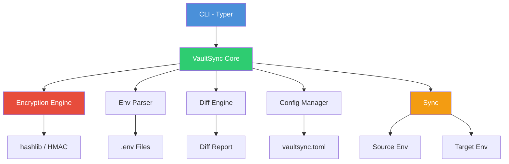

# VaultSync

[](https://github.com/officethree/VaultSync/actions/workflows/ci.yml)
[](https://www.python.org/downloads/)
[](LICENSE)
[](https://github.com/psf/black)

**A Python CLI for managing, encrypting, and syncing environment variables across projects and environments.**

VaultSync makes it easy to keep your `.env` files consistent, encrypted, and in sync across development, staging, and production environments.

---

## Architecture



---

## Quickstart

### Installation

```bash
pip install -e .
```

### Basic Usage

```bash
# Encrypt a value
vaultsync encrypt "my-secret-value" --key "encryption-key"

# Decrypt a value
vaultsync decrypt "encrypted-string" --key "encryption-key"

# Diff two env files
vaultsync diff .env.development .env.staging

# Sync env files (merge source into target)
vaultsync sync .env.development .env.staging

# Validate env file against a schema
vaultsync validate .env --schema schema.json

# Export env vars to JSON or YAML
vaultsync export .env --format json

# Show stats for an env file
vaultsync stats .env
```

### As a Library

```python
from vaultsync.core import VaultSync

vs = VaultSync(encryption_key="my-secret-key")

# Load and inspect
env_vars = vs.load_env(".env")
print(vs.get_stats(env_vars))

# Encrypt sensitive values
encrypted = vs.encrypt_value("database-password")
original = vs.decrypt_value(encrypted)

# Diff and merge environments
diff = vs.diff_envs(dev_vars, staging_vars)
merged = vs.merge_envs(base=dev_vars, override=staging_vars)

# Sync source into target file
vs.sync(".env.dev", ".env.staging")
```

---

## Features

- Symmetric encryption for secret values using hashlib-based key derivation
- Load, save, diff, merge, and validate `.env` files
- Export to JSON, YAML, or shell formats
- Schema-based validation with Pydantic
- CLI powered by Typer with rich output
- Lightweight with minimal dependencies

---

## Project Structure

```
VaultSync/
  src/vaultsync/
    __init__.py       # Package metadata and CLI app
    core.py           # VaultSync class with all operations
    config.py         # Configuration management
    utils.py          # Env parsing, encryption helpers, diff generation
  tests/
    test_core.py      # Unit tests
  docs/
    ARCHITECTURE.md   # Detailed architecture docs
  pyproject.toml      # Build config and CLI entry point
  Makefile            # Dev commands
```

---

*Inspired by secret management and DevOps trends.*

---

**Built by Officethree Technologies | Made with love and AI**
